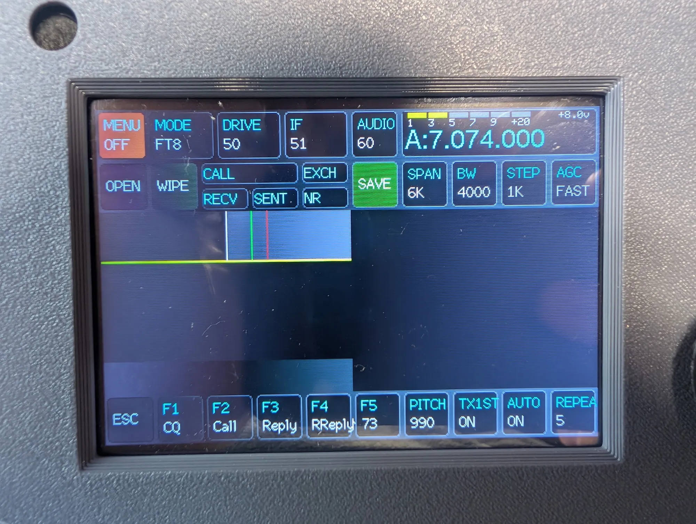

# Case: front panel stalls after the Pi connects

- **Opened:** 2026-09-25
- **Status:** Touch and encoder fixed by touch recalibration. Waterfall not yet confirmed.
- **Hardware:** zBitx v1. Raspberry Pi Zero 2 W and RP2040 front panel.

## History

1. The radio works with the factory SD card and the stock front panel firmware.
2. The owner writes the latest drexjj image to a second SD card. The owner flashes the drexjj front panel firmware.
3. The front panel stops working.
4. The owner puts the factory SD card back and flashes the stock front panel firmware.
5. The front panel still does not work.

The factory SD card never had drexjj software on it. So Pi-side state left over from drexjj cannot cause the failure in step 5.

## Symptom

This photo shows the drexjj configuration. The layout is drexjj panel firmware: AUDIO sits left of the frequency, and row 2 ends in AGC. The owner reports the same behavior with the stock configuration.

| Observation | Result |
|---|---|
| Pi boots | Yes |
| Band noise from the speaker | Yes |
| Panel shows a "waiting for Pi" message at power-on | Yes |
| Panel paints the ready screen after the Pi boots | Yes |
| Field values appear (MODE FT8, DRIVE 50, IF 51, AUDIO 60, A:7.074.000, PITCH 990) | Yes |
| Waterfall draws | No. The spectrum trace is flat and the waterfall stays dark. |
| Touch input | No response |
| Encoder rotation | No response |
| Encoder push | No response |
| Battery voltage (top right) | Updates between 7.9 V and 8.0 V at a normal rate |
| Same result with drexjj and stock | Yes, by owner report. No photo of the stock configuration yet. |

## What the code tells us

- The panel measures battery voltage with its own ADC. A live readout proves the panel loop runs. It proves nothing about the link. See [front-panel-firmware.md](../../firmware/front-panel-firmware.md#what-keeps-the-battery-readout-alive).
- The encoder acts only on a field that a touch has selected. At boot no field is selected. So dead touch makes the encoder look dead. See [fields.ino L628-L631](https://github.com/afarhan/zbitxfrontpanel/blob/dc4a5a5dcf9673c0fd16e99d86a2e60413db8c37/fields.ino#L628-L631).
- Touch calibration lives in emulated EEPROM in the panel flash. A `.uf2` flash does not erase it. See [front-panel-firmware.md](../../firmware/front-panel-firmware.md#persistent-storage-on-the-panel).
- The Pi sends the full field dump once at start, then one waterfall row. Later updates come from a timer poll. The photo shows that at least one waterfall row arrived. It cannot show whether later rows stopped or arrive with near-zero values. See [protocol.md](../../link/protocol.md).

## Working hypotheses

Touch runs entirely on the panel. The waterfall depends on the Pi and the link. So there may be two faults, or one cause that affects both.

| # | Hypothesis | Explains | Check |
|---|---|---|---|
| 1 | Bad touch calibration in panel flash | Touch, encoder | **Confirmed.** Recalibration restores touch and encoder. |
| 2 | Touch hardware fault | Touch, encoder | No calibration arrows appear, or taps do nothing during calibration. |
| 3 | Pi UI thread stalls on the I2C bus after the first row | Waterfall | Run `top -H` and `pinctrl get 6,13` on the Pi. A thread near 100% and GPIO6 low confirms it. |
| 4 | Stock panel flash did not take | All, in the stock configuration | The stock boot screen shows "zBitx firmware v1.07d". drexjj shows no version. |
| 5 | Stock panel firmware version does not match the factory Pi software | All, in the stock configuration | Compare the flashed `.uf2` with the version the factory image expects. |

## Tests done

| Date | Configuration | Test | Result |
|---|---|---|---|
| 2026-09-25 | Latest drexjj SD image and drexjj panel firmware | Touch recalibration | Touch works. Buttons respond. The encoder adjusts a selected field. |

## Open questions

- Does the waterfall draw now? If not, hypothesis 3 is next.
- Does the stock configuration also work after recalibration? The calibration data is shared, because both firmwares use EEPROM bytes 0-11.
- What corrupted the calibration? The drexjj and stock firmware use the same EEPROM layout. So the layout change alone does not explain it.
